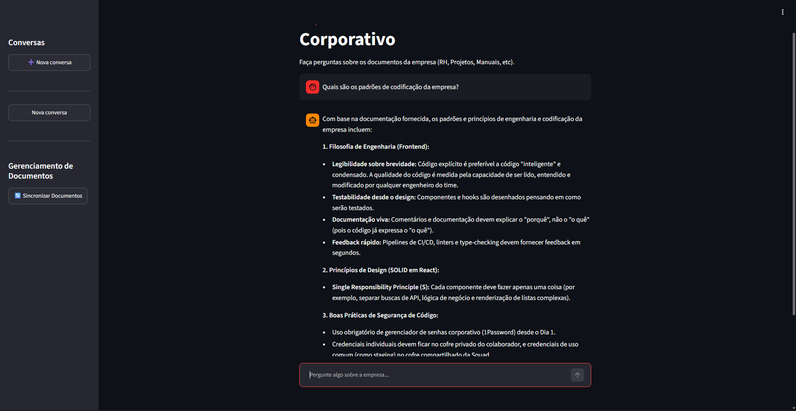

# Assistente de Conhecimento Corporativo com RAG

Projeto desenvolvido como parte do **Challenge Alura + Oracle ONE**.

<p align="center">
  
</p>

---

# Visão geral do projeto

Em empresas, informações importantes costumam estar distribuídas em documentos como manuais, guias técnicos, procedimentos internos e materiais de onboarding.

Encontrar uma informação específica pode exigir saber:
- em qual documento ela está;
- qual seção deve ser consultada;
- quais documentos estão atualizados;
- quais termos foram utilizados na documentação.

Este projeto busca simplificar esse processo por meio de um assistente conversacional onde alguém pode em vez de pesquisar manualmente nos arquivos, fazer uma pergunta em linguagem natural.

O sistema procura os trechos semanticamente mais relacionados à pergunta, seleciona os resultados mais relevantes e utiliza esses trechos como contexto para o modelo de linguagem.

O agente foi projetado para responder **somente com base nos documentos disponíveis**, evitando utilizar conhecimento externo para completar informações que não estejam presentes na base.

---

# Principais funcionalidades

- Agente inteligente que faz uso de IAs generativas e Retrieval-Augmented Generation (RAG) para responder perguntas;
- Interface gráfica estilo chat-bot para interação com o agente;
- Consulta uma base de documentos fixa, sem usar conhecimento externo ou alucinar informações;
- Permite múltiplas conversas (permanência de histórico, por enquanto, é por sessão);
- Geração de respostas utilizando Google Gemini;
- Estrutura desenvolvida para execução em ambientes de nuvem (para o projeto, foi usado o OCI).

---

# Tecnologias usadas

| Tecnologia                     | Utilização                        |
| ------------------------------ | --------------------------------- |
| Python                         | Linguagem principal para scripts  |
| LangChain                      | Orquestração do pipeline RAG      |
| Google Gemini (3.5-flash-lite) | Modelo de linguagem usado         |
| HuggingFace Embeddings         | Representação vetorial dos textos |
| ChromaDB                       | Banco de dados vetorial           |
| FlashRank                      | Reranqueamento dos documentos     |
| Unstructured                   | Leitura e extração de documentos  |
| FastAPI                        | Backend e API REST                |
| Streamlit                      | Interface web                     |
| Docker                         | Containerização                   |
| Docker Compose                 | Orquestração local dos containers |

---

# Arquitetura

A aplicação é dividida em duas partes principais:

## Backend — FastAPI

Responsável por:
- processamento dos documentos;
- geração dos embeddings;
- armazenamento e consulta no ChromaDB;
- recuperação semântica;
- reranqueamento;
- comunicação com o modelo Gemini;
- construção das respostas;
- disponibilização dos endpoints da API.

## Frontend — Streamlit

Responsável por:
- interface de chat;
- envio das perguntas para a API;
- exibição das respostas;
- gerenciamento das conversas durante a sessão;
- acionamento da sincronização dos documentos.

## Fluxo simplificado

```
flowchart LR
    A[Usuário] --> B[Streamlit]
    B --> C[FastAPI]
    C --> D[Busca vetorial]
    D --> E[ChromaDB]
    E --> F[Top 10 chunks]
    F --> G[FlashRank]
    G --> H[Top 5 chunks]
    H --> I[Prompt + Contexto]
    I --> J[Google Gemini]
    J --> C
    C --> B
    B --> A
```

---

# Estrutura do projeto

```text
Challenge-Alura-Agente/
│
├── data/
│   └── docs/
│       ├── arquitetura-de-microsservicos-e-mapa-de-dominios.pdf
│       ├── guia-oficial-de-engenharia-backend.pdf
│       ├── guia-oficial-de-engenharia-frontend.pdf
│       ├── manual-de-onboarding.pdf
│       └── manual-maestro-de-resiliencia-e-resposta-a-incidentes.pdf
│
├── src/
│   ├── backend/ 
│   │   ├── api.py
│   │   ├── config.py
│   │   ├── document_processor.py
│   │   ├── rag_agent.py
│   │   └── vector_store.py
│   │
│   └── frontend/
│       └── app.py
│
├── .dockerignore
├── .env.example
├── .gitignore
├── Dockerfile.backend
├── Dockerfile.frontend
├── docker-compose.yml
├── requirements.txt
├── LICENSE
└── README.md
```

## Responsabilidade dos principais arquivos
- `src/backend/api.py`
	- Define a aplicação FastAPI e os endpoints utilizados pelo frontend e para debug.
- `src/backend/config.py`
	- Carrega as variáveis de ambiente e configura os diretórios utilizados pela aplicação.
- `src/backend/document_processor.py`
	- Responsável pelo carregamento de documentos, criação de metadados e divisão em chunks.
- `src/backend/vector_store.py`
	- Gerencia embeddings, cria o ChromaDB, faz a sincronização de documentos e realiza busca semântica.
- `src/backend/rag_agent.py`
	- Implementa o pipeline de RAG: retrieval → reranking → prompt → Gemini → resposta
- `src/frontend/app.py`
	- Implementa a interface Streamlit, histórico da sessão e comunicação com a API.

---

# Build manual

## Pré-requisitos:
- Python 3.11 ou superior;
- Git;
- uma chave de API válida do Google Gemini.
- (linux) mesa (algumas libs são necessárias pro funcionamento do Unstructured.)
- (opcional) Curl pra fazer requisições a API pelo terminal (útil pra debug)

Para execução conteinerizada:
- Docker;
- Docker Compose.

```bash
# Clone o repositório
git clone https://github.com/MarceloFaiz/Challenge-Alura-Agente.git
cd Challenge-Alura-Agente

# Configure o .env
cp .env.example .env # Adicione a sua chave do Google gemini

# Eu recomendo manter os campos DOCS_DIR e CHROMA_DIR, por agora, como:
DOCS_DIR=./data/docs
CHROMA_DIR=./data/chromadb

###################
# Rota sem Docker #
###################

# Crie um ambiente virtual

# Linux
python -m venv .venv
source .venv/bin/activate

# Windows
python -m venv .venv
.venv\Scripts\activate

# Instale as dependências
pip install -r requirements.txt

# Inicie o backend (em um terminal)
uvicorn src.backend.api:api --reload # se você estiver no root do repositório

# Inicie o frontend (em outro terminal)
streamlit run src/frontend/app.py

###################
# Rota com Docker #
###################

# Build e inicie os containeres
docker compose up --build # Precisa estar na pasta do docker-compose.yml

# Pra monitorar os logs no terminal em tempo real
docker compose logs -f

# Para pausar, retomar, e encerrar os containeres
docker compose stop
docker compose start
docker compose down

###################
#   Após o build  #
###################

# No navegador, acesse
http://localhost:8501

```

---

# Como usar

## Sincronizando os documentos

Antes de realizar as primeiras perguntas, é necessário indexar a base documental.

Na interface do Streamlit, aperte em "🔄 Sincronizar Documentos".

O backend irá:
1. ler todos os arquivos configurados em `DOCS_DIR`;
2. extrair o conteúdo;
3. adicionar os metadados;
4. dividir os textos em chunks;
5. remover a coleção vetorial anterior;
6. recriar a coleção;
7. gerar os embeddings;
8. armazenar os novos chunks no ChromaDB.

---

## Utilizando o chat

Após a sincronização, basta escrever uma pergunta na interface.

Alguns exemplos incluem:
- Quais são as regras de backend da empresa?
- Como funciona o processo de onboarding?
- Quais são os procedimentos para resposta a incidentes?
- Quais tecnologias são utilizadas pelo frontend?
- Como os microsserviços da empresa estão organizados?

O agente irá procurar os trechos mais relevantes e elaborar uma resposta utilizando somente as informações recuperadas da base documental.

---

## Histórico de conversas

A interface permite manter várias conversas durante a execução da aplicação.

Na barra lateral é possível realizar uma "➕ Nova conversa".

Cada conversa mantém separadamente suas mensagens e recebe automaticamente um título baseado na primeira pergunta feita pelo usuário.

---

# Base documental

Os documentos utilizados pelo projeto ficam em `data/docs`

O repositório, atualmente, inclui documentos template fornecidos pela Alura, com documentos sobre:
- arquitetura de microsserviços;
- guia backend;
- guia frontend;
- entre outros

O uso da biblioteca unstructured permite o processamento de diferentes tipos de arquivos, como `.csv` e `.docx`, por exemplo.

O programa, por enquanto, está configurado de modo a receber esses documentos e responder como um ajudante em uma empresa, mas alterar seu comportamento para diferentes propósitos é relativamente trivial de fazer, com a maior modificação sendo no prompt inicial. Então é possível converter esse agente pra um ajudante em game dev, estudos, entre outros.

---

# Oracle Cloud Infrastructure

A OCI foi escolhida como a infraestrutura usada para deploy da aplicação.

A aplicação, em sua forma finalizada, faz uso dos serviços **Compute**, por meio de uma **Compute Instance**, **Conteinerização**, por meio do **OCI Container Registry (OCIR)** e **Virtual Cloud Network (VCN)**.
- Compute permite a criação de uma máquina virtual de capacidades flexíveis, onde a aplicação vai ser implantada.
- OCIR permite transformar a aplicação por completo (frontend, backend, dependências e configurações) em um container de fácil manipulação. A máquina virtual precisa apenas fazer download das imagens e rodar.
- O VCN faz a interface entre a máquina virtual e a nuvem, habilitando o acesso à aplicação de forma remota pelo navegador.

Uma forma de visualizar essa arquitetura:
```text
Projeto (código fonte, dependências)
     ↓
Docker Images (images separadas para front e backend)
     ↓
Oracle Cloud Infrastructure Registry (OCIR)
     ↓
OCI Compute (faz pull das images)
     ↓
Docker compose (inicia as duas images)
     ↓
Aplicação Web
```

Para esse projeto, eu escolhi usar uma VM baseada na shape `VM.Standard.E2.2`, da AMD por conveniência. As shapes Always free estava todas indisponíveis pra criação considerando a região da minha conta (Brazil East (São Paulo)) e eu ainda estou sob período de free trial, podendo usar 300 USD como crédito por 30 dias. Dito isso, se estivessem disponíveis, eu teria ido pelo `VM.Standard.A1.Flex` que se difere da que eu usei por usar arquitetura ARM ao invés de x86_64.

A máquina foi configurada com:
- 2 OCPUs;
- 16 GBs de memória.

---

# Limitações e Roadmap

A aplicação, no momento da entrega, apresenta funcionamento completo mas possui limitações:
- O histórico de chats existe apenas durante a sessão do Streamlit;
- O agente não tem memória de contexto. Isso significa que, em um chat, uma pergunta sequencial não significa que o agente vai considerar a pergunta anterior;
- Certos serviços da OCI não estão sendo usados, e seriam boas adições:
	- OCI Object Storage;
	- Oracle Autonomous Database;
	- OCI Vault.
- Em alguns casos, mesmo quando feito uma pergunta específica de algo no documento, o agente pode recorrer ao fallback, por não ter conseguido devolver uma resposta ideal para a pergunta;
- O processo de sincronização dos documentos faz uma reconstrução completa, ao invés de incremental.

Analisando o projeto, eu acredito que essas sejam boas opções de extenção/aprimoramento:
- [ ] Trabalhada maior no Streamlit (GUI/UX);
- [ ] Modularização da aplicação (usar mais serviços da Oracle, por exemplo)
- [ ] Implementação de memória conversacional ao agente.
- [ ] Criação de banco de dados pra armazenamento do histórico de conversas
- [ ] Geração mais robusta de metadados
- [ ] Organização do repositório (estrutura de projeto)

---

# Licensa

Este projeto está disponibilizado sob a licença MIT.

