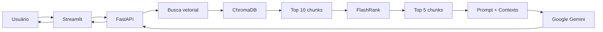

# Assistente de Conhecimento Corporativo com RAG


Projeto desenvolvido como parte do **Challenge Alura + Oracle ONE**, com o objetivo de criar um assistente de Inteligência Artificial capaz de responder perguntas sobre documentos corporativos utilizando **RAG (Retrieval-Augmented Generation)**.

A aplicação processa uma base de documentos, transforma seu conteúdo em embeddings, armazena as representações em um banco vetorial e utiliza recuperação semântica e reranqueamento para selecionar as informações mais relevantes antes de gerar uma resposta com o **Google Gemini**.

O projeto conta ainda com uma interface de chat em **Streamlit**, API em **FastAPI**, persistência vetorial com **ChromaDB** e containerização com **Docker**.

---

## Visão geral do projeto

Em empresas, informações importantes costumam estar distribuídas em documentos como manuais, guias técnicos, procedimentos internos e materiais de onboarding.

Encontrar uma informação específica pode exigir saber:
- em qual documento ela está;
- qual seção deve ser consultada;
- quais documentos estão atualizados;
- quais termos foram utilizados na documentação.

Este projeto busca simplificar esse processo por meio de um assistente conversacional.

Em vez de pesquisar manualmente nos arquivos, o usuário pode fazer uma pergunta em linguagem natural.

O sistema procura os trechos semanticamente mais relacionados à pergunta, seleciona os resultados mais relevantes e utiliza esses trechos como contexto para o modelo de linguagem.

O agente foi projetado para responder **somente com base nos documentos disponíveis**, evitando utilizar conhecimento externo para completar informações que não estejam presentes na base.

---

# Arquitetura

A aplicação é dividida em duas partes principais:

### Backend — FastAPI

Responsável por:
- processamento dos documentos;
- geração dos embeddings;
- armazenamento e consulta no ChromaDB;
- recuperação semântica;
- reranqueamento;
- comunicação com o modelo Gemini;
- construção das respostas;
- disponibilização dos endpoints da API.

### Frontend — Streamlit

Responsável por:
- interface de chat;
- envio das perguntas para a API;
- exibição das respostas;
- gerenciamento das conversas durante a sessão;
- acionamento da sincronização dos documentos.

### Fluxo simplificado



---

# Como o RAG funciona

RAG significa **Retrieval-Augmented Generation** ou **Geração Aumentada por Recuperação**. A principal ideia é não enviar toda a base documental ao modelo de linguagem a cada pergunta.

Em vez disso, o projeto utiliza um pipeline dividido em duas etapas.

## 1. Indexação dos documentos

Durante a sincronização:

```text
Documentos
    ↓
Carregamento
    ↓
Extração de texto
    ↓
Divisão em chunks
    ↓
Embeddings
    ↓
ChromaDB
```

Os arquivos são carregados utilizando a biblioteca python **Unstructured**.

O conteúdo é dividido em chunks. Para este projeto, foi escolhido a seguinte quantidade de chunks:

```text
Chunk size:    1500 caracteres
Chunk overlap: 300 caracteres
```

O overlap permite que informações localizadas na fronteira entre dois chunks não sejam completamente separadas. Além disso, cada chunk recebe também metadados como:

```text
source
filename
last_modified
```

Em seguida, são gerados embeddings utilizando os embeddings da HuggingFace, que são armazenados no ChromaDB.

---

## 2. Pergunta e resposta

Quando uma pergunta é enviada:

```text
Pergunta
   ↓
Embedding da pergunta
   ↓
Busca por similaridade
   ↓
10 chunks candidatos
   ↓
FlashRank
   ↓
5 chunks mais relevantes
   ↓
Contexto do prompt
   ↓
Gemini
   ↓
Resposta + fontes
```

Inicialmente são recuperados os **10 chunks semanticamente mais semelhantes** à pergunta.

Em seguida, o **FlashRank** realiza uma segunda etapa de classificação e seleciona os **5 resultados mais relevantes**.

Essa estratégia busca aumentar a cobertura da busca inicial sem enviar uma quantidade excessiva de contexto ao modelo.

---

# Modelo de linguagem

O agente utiliza atualmente:

```text
gemini-3.5-flash-lite
```

através da integração:

```text
langchain-google-genai
```

para favorecer respostas mais determinísticas e adequadas a um cenário de consulta documental.

O prompt do sistema também restringe explicitamente o modelo a utilizar somente informações presentes no contexto recuperado.

Caso não existam informações suficientes, a resposta esperada é:

> Desculpe, não encontrei informações sobre isso nos documentos atuais da empresa.

---

# Fontes das respostas

Cada chunk enviado ao modelo mantém o nome do arquivo de origem.

O contexto é estruturado internamente de forma semelhante a:

```text
[FONTE: guia-oficial-de-engenharia-backend.pdf]
Conteúdo recuperado...

[FONTE: manual-de-onboarding.pdf]
Conteúdo recuperado...
```

Após gerar a resposta, o sistema adiciona uma seção indicando os documentos consultados.

Exemplo:

```text
Fontes consultadas:

- guia-oficial-de-engenharia-backend.pdf
- manual-de-onboarding.pdf
```

Isso ajuda o usuário a identificar de onde vieram as informações utilizadas pelo agente.

---

# Base documental

Os documentos utilizados pelo projeto ficam em:

```text
data/docs/
```

O repositório, atualmente, inclui documentos template fornecidos pela Alura, com documentos sobre:
- arquitetura de microsserviços;
- guia backend;
- guia frontend;
- entre outros

O uso da biblioteca unstructured permite o processamento de diferentes tipos de arquivos, como `.csv` e `.docx`, por exemplo.

O programa, por enquanto, está configurado de modo a receber esses documentos e responder como um ajudante em uma empresa, mas alterar seu comportamento para diferentes propósitos é relativamente trivial de fazer, com a maior modificação sendo no prompt inicial. Então é possível converter esse agente pra um ajudante em game dev, estudos, entre outros.

---

# Estrutura do projeto

```text
Challenge-Alura-Agente/
│
├── data/
│   └── docs/
│       ├── arquitetura-de-microsservicos-e-mapa-de-dominios.pdf
│       ├── guia-oficial-de-engenharia-backend.pdf
│       ├── guia-oficial-de-engenharia-frontend.pdf
│       ├── manual-de-onboarding.pdf
│       └── manual-maestro-de-resiliencia-e-resposta-a-incidentes.pdf
│
├── src/
│   ├── backend/
│   │   ├── __init__.py
│   │   ├── api.py
│   │   ├── config.py
│   │   ├── document_processor.py
│   │   ├── rag_agent.py
│   │   └── vector_store.py
│   │
│   └── frontend/
│       └── app.py
│
├── .dockerignore
├── .env.example
├── .gitignore
├── Dockerfile.backend
├── Dockerfile.frontend
├── docker-compose.yml
├── requirements.txt
├── LICENSE
└── README.md
```

## Responsabilidade dos principais arquivos

### `src/backend/api.py`

Define a aplicação FastAPI e os endpoints utilizados pelo frontend e para debug.

### `src/backend/config.py`

Carrega as variáveis de ambiente e configura os diretórios utilizados pela aplicação.

### `src/backend/document_processor.py`

Responsável pelo carregamento de documentos, criação de metadados e divisão em chunks.

### `src/backend/vector_store.py`

Gerencia embeddings, cria o ChromaDB, faz a sincronização de documentos e realiza busca semântica.

### `src/backend/rag_agent.py`

Implementa o pipeline de RAG:

```text
retrieval → reranking → prompt → Gemini → fontes
```

### `src/frontend/app.py`

Implementa a interface Streamlit, histórico da sessão e comunicação com a API.

---

# Tecnologias utilizadas

| Tecnologia                     | Utilização                        |
| ------------------------------ | --------------------------------- |
| Python                         | Linguagem principal para scripts  |
| LangChain                      | Orquestração do pipeline RAG      |
| Google Gemini (3.5-flash-lite) | Modelo de linguagem usado         |
| HuggingFace Embeddings         | Representação vetorial dos textos |
| ChromaDB                       | Banco de dados vetorial           |
| FlashRank                      | Reranqueamento dos documentos     |
| Unstructured                   | Leitura e extração de documentos  |
| FastAPI                        | Backend e API REST                |
| Streamlit                      | Interface web                     |
| Docker                         | Containerização                   |
| Docker Compose                 | Orquestração local dos containers |

---

# Configuração

## Pré-requisitos

Para executar o projeto localmente, é necessário possuir:

- Python 3.11 ou superior;
- Git;
- uma chave de API válida do Google Gemini.

Para execução containerizada:

- Docker;
- Docker Compose.

---

# Variáveis de ambiente

Crie o arquivo `.env` a partir do exemplo:

```bash
cp .env.example .env
```

No Windows:

```powershell
copy .env.example .env
```

Configure:

```env
GOOGLE_API_KEY=SUA_CHAVE_AQUI
DOCS_DIR=./data/docs
CHROMA_DIR=./data/chromadb
```

### `GOOGLE_API_KEY`

Chave utilizada para acesso à API do Google Gemini.

### `DOCS_DIR`

Diretório contendo os documentos que serão indexados.

### `CHROMA_DIR`

Diretório utilizado para persistência do banco vetorial ChromaDB.

---

# Executando com Docker

A maneira mais simples de executar todo o projeto é utilizando Docker Compose.

## 1. Clone o repositório

```bash
git clone https://github.com/MarceloFaiz/Challenge-Alura-Agente.git
cd Challenge-Alura-Agente
```

## 2. Configure o `.env`

```bash
cp .env.example .env
```

Adicione sua chave do Google Gemini ao arquivo.

## 3. Construa e inicie os containers

```bash
docker compose up --build
```

Serão iniciados dois serviços:

```text
alura-backend   → FastAPI   → porta 8000
alura-frontend  → Streamlit → porta 8501
```

Acesse a interface em:

```text
http://localhost:8501
```

A documentação automática da API fica disponível em:

```text
http://localhost:8000/docs
```

Para encerrar os containers:

```bash
docker compose down
```

---

# Executando sem Docker

Também é possível executar o projeto diretamente com Python.

## 1. Clone o projeto

```bash
git clone https://github.com/MarceloFaiz/Challenge-Alura-Agente.git
cd Challenge-Alura-Agente
```

## 2. Crie um ambiente virtual

Linux/macOS:

```bash
python -m venv .venv
source .venv/bin/activate
```

Windows:

```powershell
python -m venv .venv
.venv\Scripts\activate
```

## 3. Instale as dependências

```bash
pip install -r requirements.txt
```

## 4. Configure o `.env`

```env
GOOGLE_API_KEY=SUA_CHAVE_AQUI
DOCS_DIR=./data/docs
CHROMA_DIR=./data/chromadb
```

## 5. Inicie o backend

Na raiz do projeto:

```bash
uvicorn src.backend.api:app --reload
```

A API estará disponível na porta `8000`.

## 6. Inicie o frontend

Em outro terminal:

```bash
streamlit run src/frontend/app.py
```

O Streamlit estará disponível na porta `8501`.

---

# Sincronizando os documentos

Antes de realizar as primeiras perguntas, é necessário indexar a base documental.

Na interface do Streamlit, aperte em "🔄 Sincronizar Documentos".

O backend irá:
1. ler todos os arquivos configurados em `DOCS_DIR`;
2. extrair o conteúdo;
3. adicionar os metadados;
4. dividir os textos em chunks;
5. remover a coleção vetorial anterior;
6. recriar a coleção;
7. gerar os embeddings;
8. armazenar os novos chunks no ChromaDB.

A sincronização atual realiza uma **reconstrução completa da coleção vetorial**.

Portanto, sempre que os documentos forem alterados, adicionados ou removidos, uma nova sincronização deve ser executada.

---

# Utilizando o chat

Após a sincronização, basta escrever uma pergunta na interface.

Alguns exemplos incluem:
- Quais são as regras de backend da empresa?
- Como funciona o processo de onboarding?
- Quais são os procedimentos para resposta a incidentes?
- Quais tecnologias são utilizadas pelo frontend?
- Como os microsserviços da empresa estão organizados?

O agente irá procurar os trechos mais relevantes e elaborar uma resposta utilizando somente as informações recuperadas da base documental.

---

# Histórico de conversas

A interface permite manter várias conversas durante a execução da aplicação.

Na barra lateral é possível realizar uma "➕ Nova conversa".

Cada conversa mantém separadamente suas mensagens e recebe automaticamente um título baseado na primeira pergunta feita pelo usuário.

### Limitação atual

O histórico utiliza o `session_state` do Streamlit. Isso significa que ele é um **histórico de interface**, e não uma memória persistente do agente. As conversas não são atualmente armazenadas em um banco de dados e podem ser perdidas ao reiniciar a sessão ou a aplicação.

Além disso, o histórico não é enviado ao modelo como contexto. Cada pergunta é respondida individualmente a partir dos documentos recuperados.

---

# API

O backend disponibiliza uma API REST através do FastAPI.

## `GET /health`

Verifica se a aplicação está funcionando e retorna a quantidade de chunks existentes no ChromaDB.

Exemplo de resposta:

```json
{
  "status": "ok",
  "chunks": 120
}
```

---

## `POST /chat`

Envia uma pergunta para o agente.

### Request

```json
{
  "question": "Quais são as regras de backend?"
}
```

### Response

```json
{
  "answer": "Resposta gerada pelo agente..."
}
```

---

## `POST /sync`

Reprocessa os documentos e recria a base vetorial.

Exemplo de resposta:

```json
{
  "status": "success",
  "message": "Banco de dados atualizado com sucesso.",
  "chunks": 120
}
```

---

## `POST /debug/search`

Endpoint auxiliar utilizado para inspecionar diretamente os resultados da busca vetorial.

### Request

```json
{
  "question": "ferramentas homologadas"
}
```

O endpoint retorna os documentos e trechos encontrados antes da etapa de geração da resposta.

Esse recurso é especialmente útil durante o desenvolvimento para distinguir problemas de **retrieval** de problemas relacionados ao modelo de linguagem.

---

# Por que utilizar RAG?

Um modelo de linguagem isolado não possui acesso automático aos documentos internos de uma organização.

Além disso, simplesmente enviar documentos inteiros ao modelo apresenta problemas como:
- aumento do uso de tokens;
- maior latência;
- dificuldade em trabalhar com bases grandes;
- maior chance de informações irrelevantes influenciarem a resposta;
- dificuldade de atualização da base.

Com RAG, somente os trechos considerados mais relevantes são enviados ao modelo.

Isso também permite atualizar o conhecimento do agente através da sincronização dos documentos, sem precisar treinar novamente o modelo de linguagem.

---

# Retrieval + Reranking

O projeto utiliza duas etapas de seleção.

### Primeira etapa — busca vetorial

O ChromaDB retorna os:

```text
10 chunks mais semelhantes
```

à pergunta segundo os embeddings.

### Segunda etapa — reranking

O FlashRank reavalia os candidatos considerando diretamente a relação entre pergunta e conteúdo.

São então selecionados:

```text
5 chunks
```

para formar o contexto final.

A estratégia busca combinar:

```text
maior recall na recuperação
        +
maior precisão no contexto final
```

antes da chamada ao modelo.

---

# Containerização

Backend e frontend utilizam imagens separadas.

```text
Dockerfile.backend
Dockerfile.frontend
```

O Docker Compose conecta os dois serviços:

```text
┌─────────────────────┐
│     Streamlit       │
│      :8501          │
└──────────┬──────────┘
           │ HTTP
           ▼
┌─────────────────────┐
│      FastAPI        │
│       :8000         │
└──────────┬──────────┘
           │
     ┌─────┴─────┐
     ▼           ▼
 ChromaDB      Gemini
```

Dentro da rede Docker, o frontend acessa o backend através de:

```text
http://backend:8000
```

enquanto o usuário acessa o Streamlit pela porta `8501`.

---

# Oracle Cloud Infrastructure

A aplicação foi estruturada de forma a facilitar sua execução em infraestrutura de nuvem.

A separação entre backend e frontend e a utilização de imagens Docker permitem um fluxo de deploy compatível com serviços da **Oracle Cloud Infrastructure (OCI)**.

Uma arquitetura possível é:

```text
Código-fonte
     ↓
Docker Images
     ↓
Oracle Cloud Infrastructure Registry (OCIR)
     ↓
OCI Compute
     ↓
Backend + Frontend
     ↓
Aplicação Web
```

As imagens do frontend e backend podem ser construídas, enviadas para um registry e posteriormente executadas em uma instância de Compute, mantendo a mesma arquitetura utilizada no ambiente local.

Em um cenário de produção, componentes locais como armazenamento dos documentos e ChromaDB também poderiam ser substituídos ou complementados por serviços gerenciados de nuvem.

---

# Possíveis evoluções

Algumas extensões possíveis para o projeto são:
- persistência do histórico de conversas;
- autenticação de usuários;
- controle de acesso aos documentos;
- upload de documentos pela interface;
- sincronização incremental em vez da reconstrução completa do ChromaDB;
- filtros por metadados;
- avaliação automatizada da qualidade do retrieval;
- armazenamento do histórico em banco de dados;
- memória conversacional opcional;
- cache de embeddings;
- streaming das respostas;
- observabilidade e métricas;
- integração com serviços nativos da OCI;
- utilização de banco vetorial gerenciado em produção.

---

# Limitações atuais

Este projeto foi desenvolvido como uma aplicação demonstrativa e possui algumas limitações importantes:

- o histórico de chats existe apenas durante a sessão do Streamlit;
- não existe autenticação ou separação de usuários;
- a sincronização reconstrói toda a coleção vetorial;
- o ChromaDB é utilizado localmente;
- os documentos são lidos a partir do sistema de arquivos;
- a resposta depende da qualidade da extração dos documentos e do retrieval;
- modelos generativos podem produzir respostas incorretas mesmo quando recebem contexto relevante.

